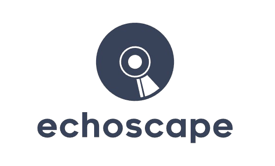

<link rel="stylesheet" type="text/css" href="index.css">

::: title

Echoscape
:::

::: authors
Gianlorenzo Urbano, 0001020458 
Liam Busnelli  
 
Report for the Mobile Applications laboratory 
"Your City is Listening to" 
:::

 
 
 
 
 
 
 
 
 
 
 
 
 

:::: content

## Table of Contents

- [Table of Contents](#table-of-contents)
- [Introduction](#introduction)
  - [Implementation choices](#implementation-choices)
  - [Technologies used](#technologies-used)
  - [Project structure](#project-structure)
  - [How to run the project](#how-to-run-the-project)
  - [How to test the project](#how-to-test-the-project)
- [Design](#design)
- [Features](#features)

## Introduction

The Echoscape mobile application is an interactive tool designed to crowd-source and analyze the music played throughout a city. This React Native-based application, compatible with both Android and iOS, allows users to record audio through their phone's microphone, geo-tag the recordings, and view them on a map. The backend service provided by the university processes these recordings, returning detailed information on each song, such as genre, mood, and instrumental content. Users can explore audio data across the city, view recordings contributed by other users, and interact with their own recordings

### Implementation choices
The Echoscape mobile application was developed using React Native, a popular JavaScript framework for building mobile applications. React Native allows developers to write code once and deploy it to both Android and iOS platforms, making it an ideal choice for this project. The application uses the Expo development environment, which provides a range of tools and services to simplify the development process. The backend service is implemented using Python and Flask, a lightweight web framework that is well-suited for building RESTful APIs. The application uses the Google Maps API to display audio recordings on a map, allowing users to explore the data geographically. The application also uses the Spotify API to retrieve detailed information about the songs recorded by users. The application is designed to be user-friendly and intuitive, with a clean and modern interface that is easy to navigate.

### Technologies used

- React Native
- Expo
- Expo SQLite
- Expo Router
- Expo Location
- Expo AV
- React Native Reanimated
- React Native Gesture Handler
- React Native Maps
- 

### Project structure

### How to run the project

### How to test the project

## Design

## Features

::::